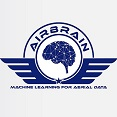
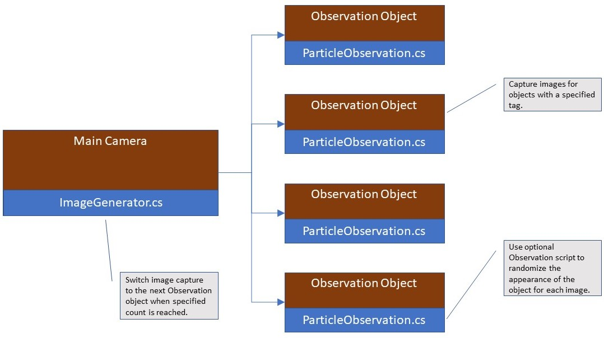
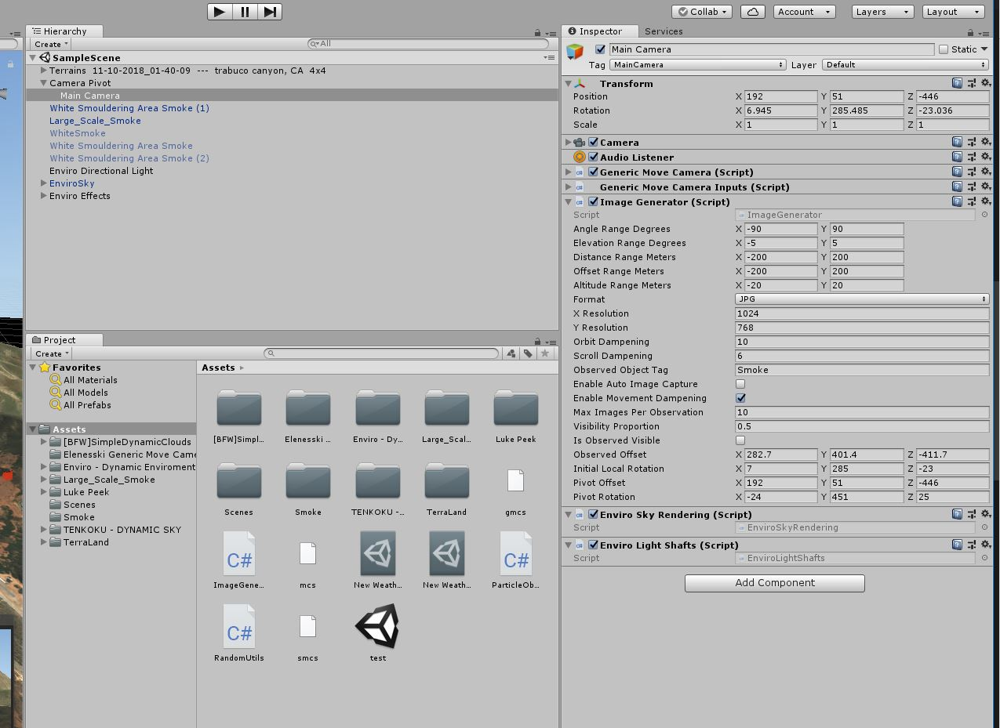
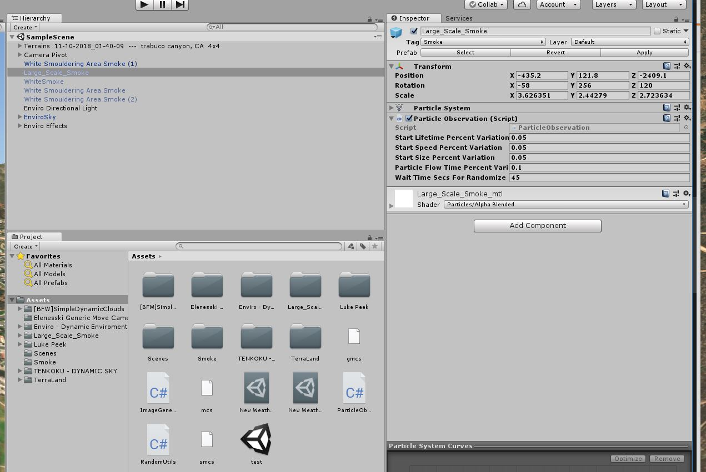
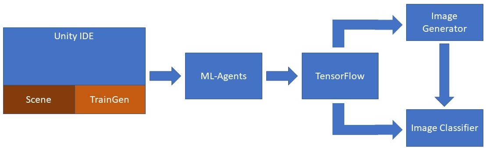

Welcome to the AirBrain.org project!

This project provides the source code to facilitate the creation of machine learning algorithms that can be used for the analysis of aerial video. The first such module in the AirBrain project is called TrainGen and is described in this page.  

# Introduction
Generating training data that can be used in the context of detecting a natural or unnatural disaster would require the collection of aerial video associated with an actual disaster. In the case of early fire detection, this would require the collection of images during a controlled burn, an infrequent and difficult event to stage. Even so, it is unlikely that the images collected during a controlled burn would be sufficient in number to encompass the wide variety of terrain required to adequately train a deep network.  

This is where Unity and TrainGen come in. Using Unity assets purchased from the Unity Asset Store any type of terrain can be generated along with an endless variety of smoke to realistically simulate the early stages of a forest fire.  The TrainGen scripts are used to capture images of each occurrence of smoke from a random camera position and orientation. A flyover video of the terrain used for one such image capture sequence is linked below. The assets used to generate the scene are listed in the Appendix.

The remainder of this document provides instructions for how to use the C# scripts in the TrainGen project to automatically generate images of randomly modified objects at random positions and orientations.  The specific use case demonstrated generates images of smoke at high altitude over a forest in the Trabuco Canyon area of California.

# Unity Scripts

This short video sequence demonstrates the use of the TrainGen scripts to automatically move the main camera around designated objects in the scene. In this demonstration the objects are smoke trails representing the early stages of an uncontrolled fire. Each time the camera is moved an image is captured and saved in one of two directories, one reserved for scenes where the object is present, and the other for where it is not. Both types of images are used to train a Deep Learning network and verify correct output when the particular object is not present. The position of the camera and parameters for appearance of the smoke are randomly modified between images using predefined ranges for each value modified.

In the beginning of the video the main camera is shown moving to new positions with short pauses between each movement.  This occurs because the camera movements are triggered when the user presses the right shift key on the keyboard.  Later each movement occurs without being triggered and each new movement occurs without delay.  This generates images as fast as possible while they are saved in their respective directories.  

If a smoke trail appears in the scene, the smoke particles flow for a randomly generated time period before the image is captured.  This allows time for changes in the properties of the particle system used to generate the smoke trail to appear on screen.

# TrainGen Design
TrainGen works by capturing images of objects relative to a pivot point.  Whenever a new image is about to be generated the value of the image count is checked to determine if the next object should be accessed for image capture.  If so, then the camera is moved to the location of the next object in two stages.  First, the local position of the camera (the position relative to the pivot point) is calculated.  Second, the global position of the pivot point is calculated relative to the location of the object.

The pivot point is used to rotate the camera. You can imagine the pivot point as the body of a person holding a long selfie stick used to change the orientation of a camera on the end of the stick. More information on how the pivot point can be used to control camera rotation is in a YouTube video called "Simple Mouse Orbit Camera Control", linked in the Appendix section.

When adding TrainGen to a scene, it is important to establish the desired location of the pivot point relative to the camera.  This is information is saved in certain property variables in the ImageGenerator object, described below.  

Every object that will be used for image capture can optionally contain a script that allows the appearance of the object to be randomly modified for each image using the Randomize method. TrainGen contains one example script used to randomize a particle system for a smoke trail, used to simulate the early stages of a forest fire.

# TrainGen Class Documentation
Documentation for the each of the classes in the TrainGen module is available here: [TODO: Doxygen documentation]. The documentation is generated automatically using Doxygen, run from a shell script [TODO: create script]. 

# Step-by-step Guide to Using TrainGen in Your Unity Project
This section provides a detailed walk-through of how to integrate the TrainGen scripts into a typical Unity project. No installer is currently provided, so you must manually copy each script file to the Assets directory in the root directory of your Unity project.  

Familiarity with Unity scripting and the associated Unity IDE are assumed. See the Appendix for additional references.

Included below is a list of each C# source file with a brief description. A description of each of the properties defined in each source file is contained in the class documentation.

**ImageGenerator.cs**

Primary script which drives the image generation state machine. This includes the control of the camera position, orientation, and selection of the object for image capture ("Observation").

**ParticleObservation.cs**

Optional script called by ImageGenerator to trigger the randomization of the appearance of an object within an Observation.

**RandomUtils.cs**

Utility functions to generate a random number or random range within a specified minimum and maximum value.
  
The source code of each script is highly commented and will hopefully be self-documenting. For this reason, a walk-through of the source code is not provided in this page. Nevertheless, if you believe one is needed let us know by creating an Issue in GitHub.

## Step 1: Image Generator
Your Unity scene must contain a camera object and at least one other object that will act as the focal point for the capture of images.  This other object in the terminology of TrainGen is called an "Observation" and is discussed in more detail for the scripts that include the word "Observation" in their class name. Those Observations that are tagged with the name specified in the "**Observed Object Tag**" property are automatically included in the list of observations for image capture.  

Add the ImageGenerator.cs script to the camera object in your Unity scene.

Use of the ImageGenerator.cs script in the MainCamera for a particular scene is depicted below.

You will notice that the "Main Camera" object is the child of another object called "Camera Pivot". The name of the parent object is not important, just that it be in a position that corresponds to the desired pivot point for the rotation of Main Camera.  In general, the location of the pivot point is in proximity to the Observation object so that the images captured will represent different views of the object associated with the pivot point.  

For now, leave the default values of each property in the Image Generator script unchanged, with the exception of those discussed below.  More information on each property is available in the [TrainGen Class Documentation](#traingen-class-documentation).

Images will be captured for those objects with a "**Tag**" property that matches the value of the "**Observed Object Tag**" property in the ImageGenerator object. In the example above the tag value of "Smoke" is used for each of the particle system objects that simulate smoke in various forms:
- White Smouldering Area Smoke (n)
- WhiteSmoke
- Large_Scale_Smoke

## Step 2: Observation Selection
Images generated for tagged objects are called "**Observations**". As mentioned above, the tag used must match that of the "**Observed Object Tag**" property of ImageGenerator.  Optionally, a script maybe added to allow the appearance of each observation to be randomized at the beginning of each new image.

In the example shown below, the script "ParticleObservation" (provided with TrainGen) is added to the Large_Scale_Smoke object. The ParticleObservation component is retrieved in the SelectObservation method of ImageGenerator and, if present, the the Randomize method is called.

If your observation is a particle system the ParticleObservation.cs script may be added to your object. The way in which each observation is randomized is highly dependent on the type of objects it contains so you will need to examine the source code of ParticleObservation.cs to see if it is applicable.

## Step 3: Generating Images
Press the play button in the Unity IDE and then press the right-shift key.  This will cause the camera to move to the first Observation and, if the object is visible, capture an image.  Press the right-shift key again and the camera will move to the next randomly generated position and capture an other image.  This process will continue until the specified number of Observations with visible objects have been captured. Additional images will be captured for the same camera position, but without a visible object.  The number of images captured w/wo visible objects is configured using the "Max Images Per Observation" and "**Visibility Proportion**" properties.

Captured images are saved in the "screenshots" directory of the Unity project directory. Images with visible objects are saved in a subdirectory with the same name as the value of the "**Observed Object Tag**" property. Images without visible objects are saved in the "nothing" subdirectory.

To allow image generation to proceed automatically without requiring the right-shift key to be pressed for each image, check the "**Enable Auto Image**" property. Uncheck the same property to return to manual image generation.

# Long Term Project Plan
## TrainGen
Additional enhancements are planned to allow TrainGen to randomly vary other aspects of the scene, including:
- Automatic creation of smoke on the terrain at a specified density, at random locations
- Randomization of the weather and lighting
- Automatic selection of predefined terrains after the required number of images for another terrain have been generated 
## Use of TrainGen Images to Seed a Generative Adversarial Network (GAN)
## Deployment on a UAS
## Integration with Unity's ML-Agents Tool

Unity Technologies has made available a toolkit to support the creation of machine learning algorithms that interact with the graphical content in a Unity project. Tensor Flow is used for those algorithms that use Deep Learning.  

In the diagram shown below TrainGen is used in a Unity project that uses ML-Agents to communicate with a Generative Adversarial Network (GAN) developed with TensorFlow, and send dynamically generated training images. The feature vector which controls the content of the generated images is formed as the output of the Image Generator network and later sent back to the Unity project to be rendered.  The Image Classifier accepts these rendered images as training input to a classifier network which attempts to classify the renered image.  The output of this classification is used as input to the Image Generator which forms another feature vector for rendering. The objective of the Image Generator network is to create images that the classifier is unable to identify.

# Call for Collaboration
The primary mission of AirBrain.org is to enable the creation of open source machine learning solutions for use in the aerial domain. This cannot happen without the involvement of many other collaborators from various domains, some of which are listed below. If you would like to contribute to this project, or have any ideas on how we can begin collaboration with any of the entities listed below, please post to the Issues section of github for this project. If you would prefer to communicate privately send a message to airbrain.org@gmail.com.

- Universities and government authorities conducting research on early fire detection
- Researchers investigating the use of simulation data to train machine learning algorithms for aerial observation
- Artists and game developers interested in creating simulators for other types of aerial terrain
- Anyone else in need of more data for their aerial machine learning application

# Appendix
This section contains a list of the resources used to develop and test the TrainGen scripts. Thanks to the Unity ecosystem, so much can be accomplished in a short period of time!

## References
- [Unity Engine Tutorial](https://unity3d.com/learn/tutorials)
- [Simple Mouse Orbit Camera Control How-To](https://www.youtube.com/watch?v=bVo0YLLO43s)

## Development Tools
- [Unity IDE](https://store.unity.com/)
- [Unity ML-Agents](https://github.com/Unity-Technologies/ml-agents)

## Unity Assets Used
Assets used in the example scene developed for TrainGen:
  - [Generic Move Camera](https://assetstore.unity.com/publishers/11279)
  - [TerraLand 3](https://assetstore.unity.com/packages/tools/terrain/terraland-3-119097)
  - [Enviro Sky and Weather](https://assetstore.unity.com/packages/tools/particles-effects/enviro-sky-and-weather-33963)
  - [Realistic Smoke VFX](https://assetstore.unity.com/packages/vfx/particles/fire-explosions/realistic-smoke-vfx-58504)
  - [Large Scale Smoke](https://assetstore.unity.com/packages/vfx/particles/fire-explosions/large-scale-smoke-91966)
